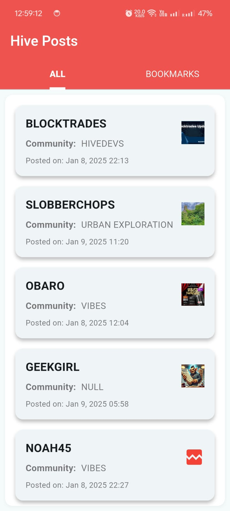
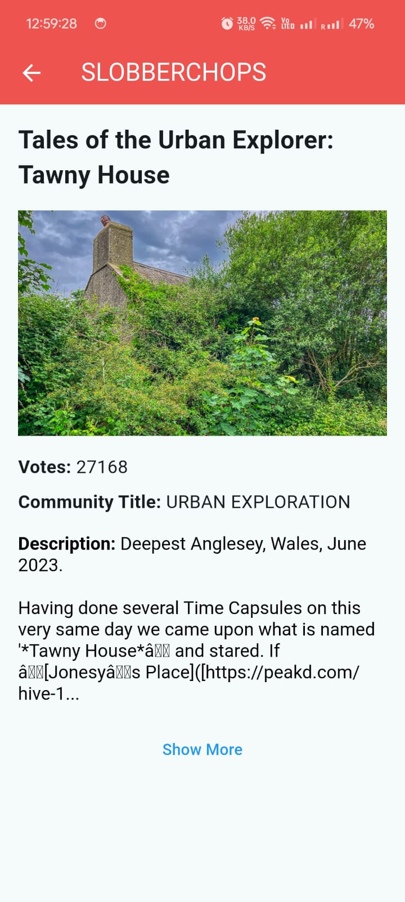
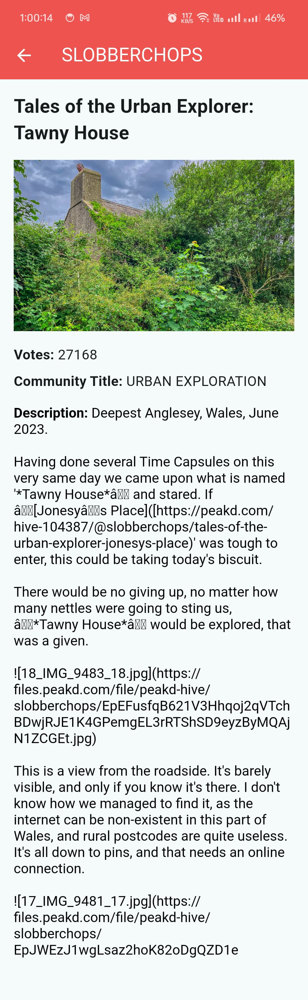
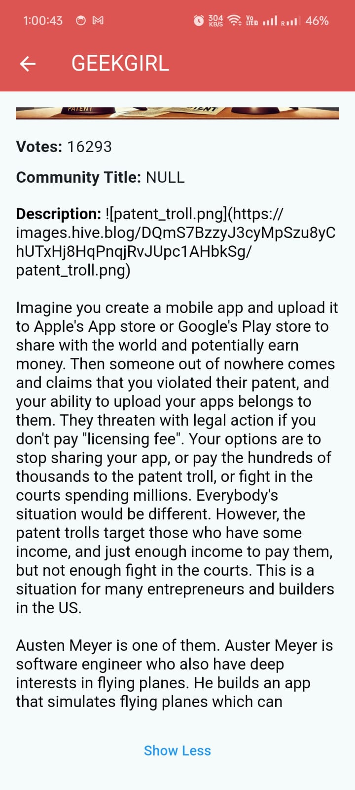

# HiveApp

HiveApp is a Flutter-based mobile application. This project serves as a starting point for building a fully-featured Flutter app.

## Getting Started

These instructions will help you set up and run the project on your local machine for development and testing.

### Prerequisites

Before running the project, make sure you have the following installed:

- [Flutter SDK](https://docs.flutter.dev/get-started/install)
- Dart SDK
- An editor such as [VS Code](https://code.visualstudio.com/) or [Android Studio](https://developer.android.com/studio)
- A physical device or emulator for testing

### Installing

1. Clone the repository to your local machine:

   ```bash
   git clone https://github.com/Lokeshburade007/hive_posts_api.git


### Steps to Add Screenshots
1. Create a folder named `assets/screenshots` in your project root directory.
2. Place your screenshots (e.g., `1.png`, `2.png`, `3.png`, `4.png`) inside this folder.
3. Make sure your images are referenced correctly in the README using relative paths.

### App Snapshots

Below are some screenshots and a video demo of the app:






### Demo Video

[Watch the Demo Video](assets/screenshots/demo.mp4)


Let me know if you need any more help!
